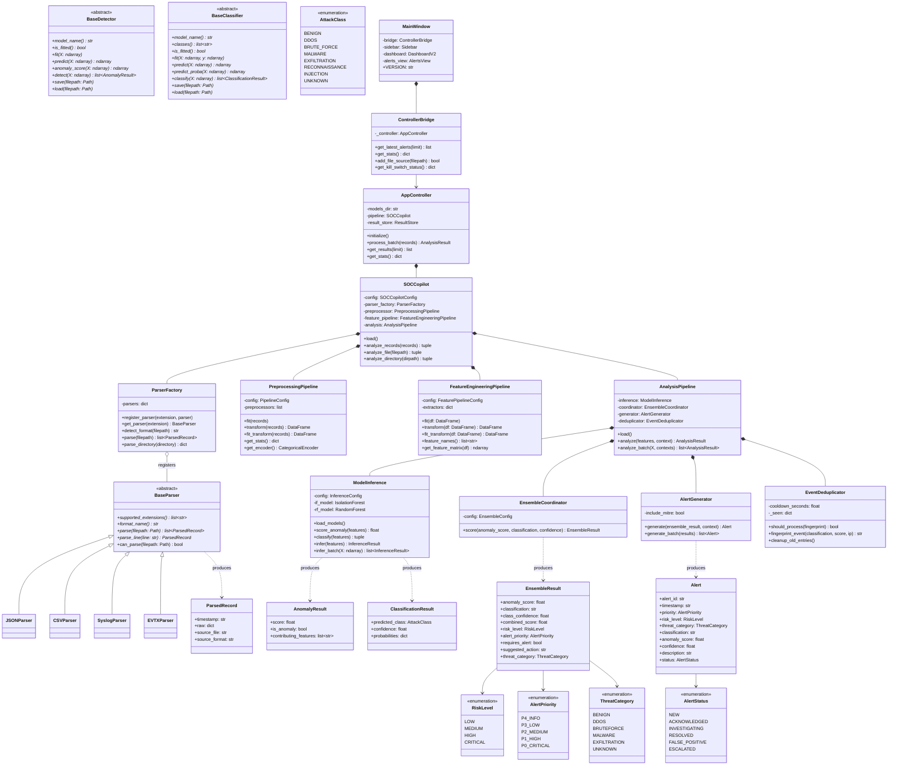
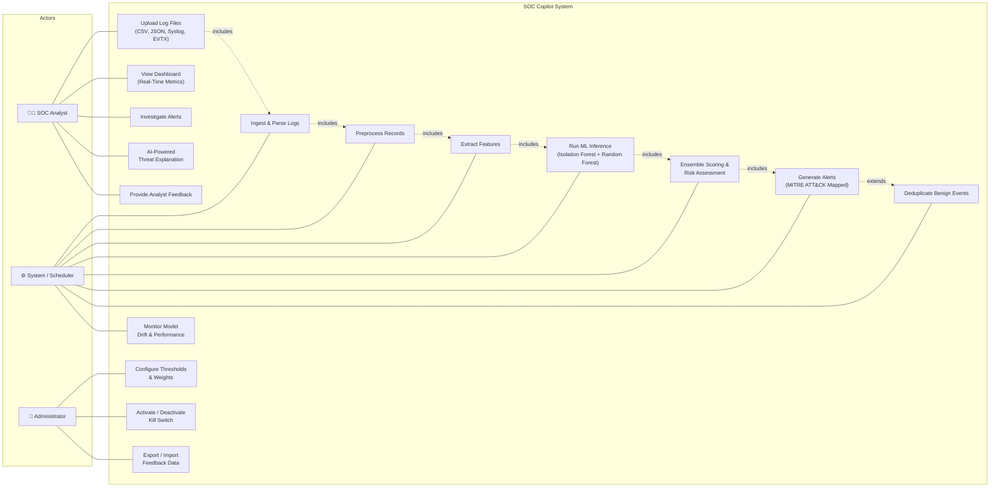
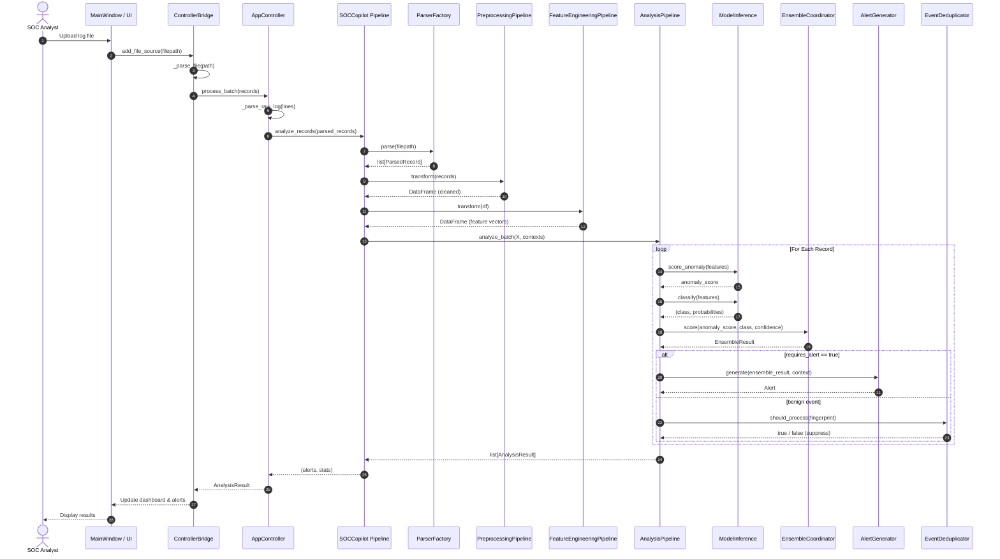
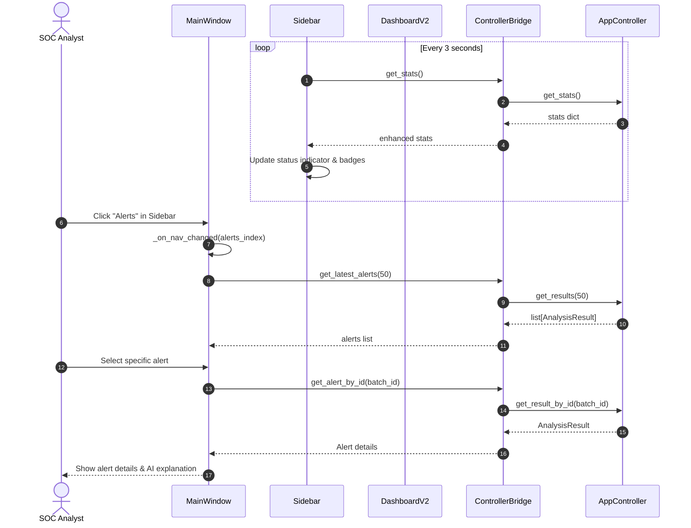
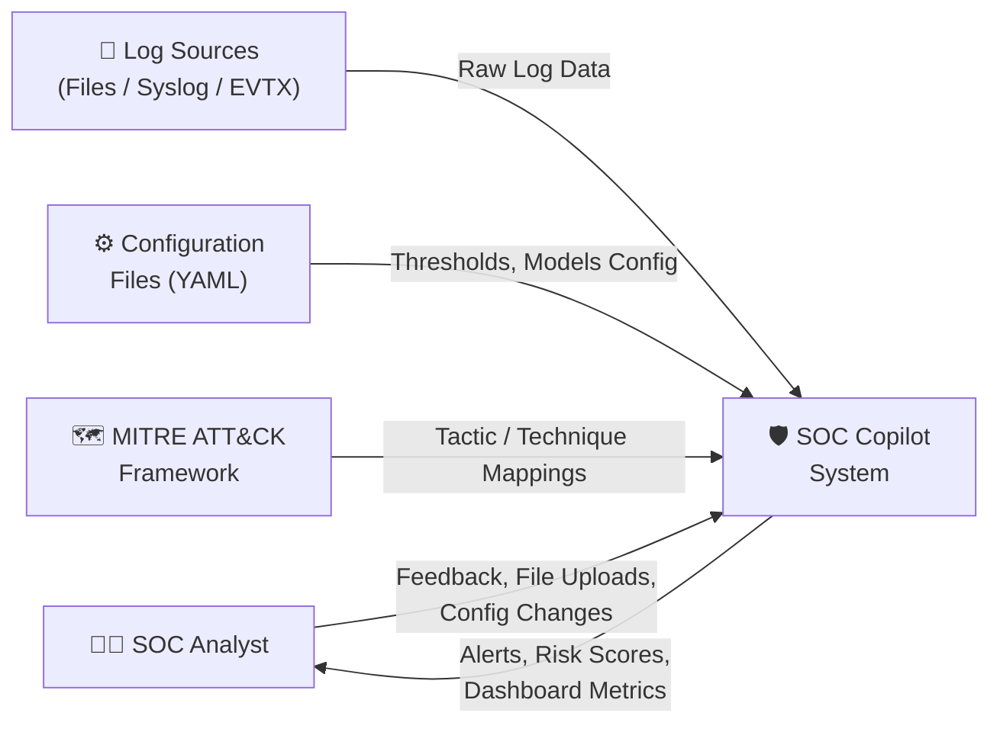
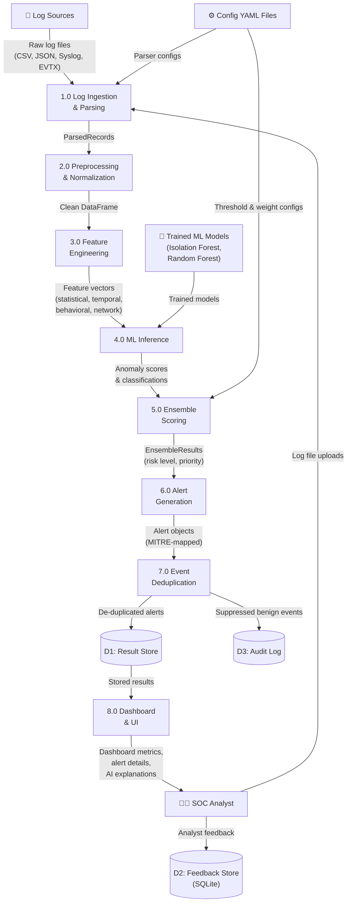
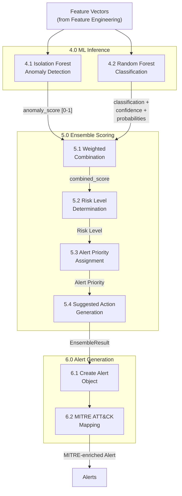

# SOC Copilot — UML Diagrams

This document contains four UML diagrams for the SOC Copilot project:

1. [Class Diagram](#1-class-diagram)
2. [Use Case Diagram](#2-use-case-diagram)
3. [Sequence Diagram](#3-sequence-diagram)
4. [Data Flow Diagram](#4-data-flow-diagram)

---

## 1. Class Diagram

---

## 2. Use Case Diagram

---

## 3. Sequence Diagram

### 3.1 End-to-End Log Analysis Flow

### 3.2 Dashboard Polling & Alert Investigation

---

## 4. Data Flow Diagram (DFD)

### Level 0 — Context Diagram

### Level 1 — Major Processes

### Level 2 — ML Inference & Ensemble Detail

---

> **Note:** These diagrams use [Mermaid](https://mermaid.js.org/) syntax and render natively on GitHub, GitLab, VS Code (with Mermaid extensions), and most modern Markdown viewers.
